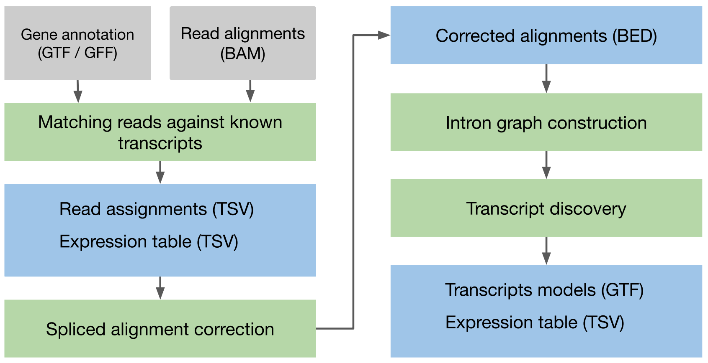
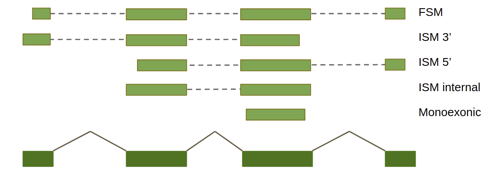
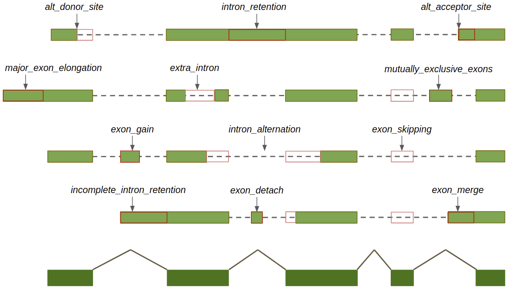
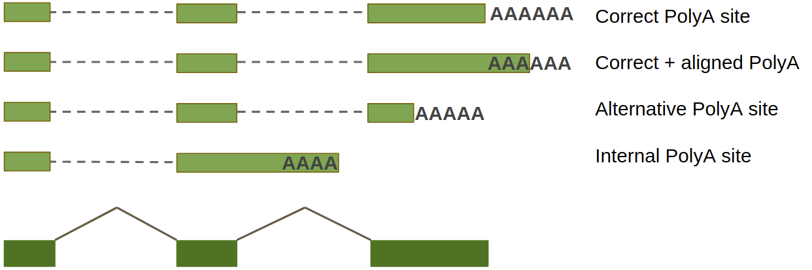

[](https://anaconda.org/bioconda/isoquant)
[](https://www.python.org/downloads/)
[](https://www.gnu.org/licenses/old-licenses/gpl-2.0)
[](https://github.com/ablab/IsoQuant/releases/)
[](https://github.com/ablab/IsoQuant/releases)
[](https://github.com/ablab/IsoQuant/actions/workflows/Unit_tests.yml)
[](https://ablab.github.io/IsoQuant/)


# IsoQuant 3.5 manual

[New IsoQuant documentation](https://ablab.github.io/IsoQuant/) is available. This README will be removed at some point.


**Quick start:**  

*   IsoQuant can be downloaded from [https://github.com/ablab/IsoQuant](https://github.com/ablab/IsoQuant) or installed via conda:

        conda create -c conda-forge -c bioconda -n isoquant python=3.8 isoquant

*   If installing manually, you will need Python3 (3.8 or higher), [gffutils](https://pythonhosted.org/gffutils/installation.html), [pysam](https://pysam.readthedocs.io/en/latest/index.html), [pybedtools](https://daler.github.io/pybedtools/), [biopython](https://biopython.org/) and some other common Python libraries to be installed. See `requirements.txt` for details. You will also need to have [minimap2](https://github.com/lh3/minimap2) and [samtools](http://www.htslib.org/download/) to be in your `$PATH` variable.

*   Verify your installation by running:

        isoquant.py --test

*   To run IsoQuant on raw FASTQ/FASTA files use the following command

        isoquant.py --reference /PATH/TO/reference_genome.fasta \
        --genedb /PATH/TO/gene_annotation.gtf \
        --fastq /PATH/TO/sample1.fastq.gz /PATH/TO/sample2.fastq.gz \
        --data_type (assembly|pacbio_ccs|nanopore) -o OUTPUT_FOLDER

    For example, using the toy data provided within this repository,

        ./isoquant.py --reference tests/toy_data/MAPT.Mouse.reference.fasta \
        --genedb tests/toy_data/MAPT.Mouse.genedb.gtf \
        --fastq tests/toy_data/MAPT.Mouse.ONT.simulated.fastq \
        --data_type nanopore -o toy_data_out


* To run IsoQuant on aligned reads (make sure your BAM is sorted and indexed) use the following command:

        isoquant.py --reference /PATH/TO/reference_genome.fasta \
        --genedb /PATH/TO/gene_annotation.gtf \
        --bam /PATH/TO/sample1.sorted.bam /PATH/TO/sample2.sorted.bam \
        --data_type (assembly|pacbio_ccs|nanopore) -o OUTPUT_FOLDER

    For example, using the toy data provided within this repository,

        ./isoquant.py --reference tests/toy_data/MAPT.Mouse.reference.fasta \
        --genedb tests/toy_data/MAPT.Mouse.genedb.gtf \
        --fastq tests/toy_data/MAPT.Mouse.ONT.simulated.fastq \
        --data_type nanopore -o toy_data_out

* If using official annotations containing `gene` and `transcript` features use `--complete_genedb` to save time.

* Using reference annotation is optional since version 3.0, you may preform de novo transcript discovery without providing `--genedb` option':

        isoquant.py --reference /PATH/TO/reference_genome.fasta \
        --fastq /PATH/TO/sample1.fastq.gz /PATH/TO/sample2.fastq.gz \
        --data_type (assembly|pacbio|nanopore) -o OUTPUT_FOLDER

* If multiple files are provided, IsoQuant will create a single output annotation and a single set of gene/transcript expression tables.


## Table of contents

1. [About IsoQuant](#sec1) </br>
1.1. [Supported data types](#sec1.1)</br>
1.2. [Supported reference data](#sec1.2)</br>
2. [Installation](#sec2)</br>
2.1. [Installing from conda](#sec2.1)</br>
2.2. [Installation from GitHub](#sec2.2)</br>
2.3. [Verifying your installation](#sec2.3)</br>
3. [Running IsoQuant](#sec3)</br>
3.1. [IsoQuant input](#sec3.1)</br>
3.2. [Command line options](#sec3.2)</br>
3.3. [IsoQuant output](#sec3.3)</br>
4. [Visualization](#sec4)</br>
5. [Citation](#sec5)</br>
6. [Feedback and bug reports](#sec6)</br>

<a name="sec1"></a>
# About IsoQuant

IsoQuant is a tool for the genome-based analysis of long RNA reads, such as PacBio or
Oxford Nanopores. IsoQuant allows to reconstruct and quantify transcript models with
high precision and decent recall. If the reference annotation is given, IsoQuant also
assigns reads to the annotated isoforms based on their intron and exon structure.
IsoQuant further performs annotated gene, isoform, exon and intron quantification.
If reads are grouped (e.g. according to cell type), counts are reported according to the provided grouping.

IsoQuant consists of two stages, which generate its own output:
1. Reference-based analysis. Runs only if reference annotation is provided. Performs read-to-isoform assignment,
splice site correction and abundance quantification for reference genes/transcripts.
2. Transcript discovery. Reconstructs transcript models and performs abundance quantification for discovered isoforms.

Latest IsoQuant version can be downloaded from [https://github.com/ablab/IsoQuant/releases/latest](https://github.com/ablab/IsoQuant/releases/latest).

New IsoQuant documentation is available [here](https://ablab.github.io/IsoQuant/).

#### IsoQuant pipeline


<a name="sec1.1"></a>
## Supported data types

IsoQuant support all kinds of long RNA data:
* PacBio CCS
* ONT dRNA / ONT cDNA
* Assembled / corrected transcript sequences

Reads must be provided in FASTQ or FASTA format (can be gzipped). If you have already aligned your reads to the reference genome, simply provide sorted and indexed BAM files.

IsoQuant expect reads to contain polyA tails. For more reliable transcript model construction do not trim polyA tails.

IsoQuant can also take aligned Illumina reads to correct long-read spliced alignments. However, short reads are _not_
used to discover transcript models or compute abundances.

<a name="sec1.2"></a>
## Supported reference data

Reference genome should be provided in multi-FASTA format (can be gzipped).
Reference genome is mandatory even when BAM files are provided.

Reference gene annotation is not mandatory, but is likely to increase precision and recall.
It can be provided in GFF/GTF format (can be gzipped).
In this case it will be converted to [gffutils](https://pythonhosted.org/gffutils/installation.html) database. Information on converted databases will be stored in your `~/.config/IsoQuant/db_config.json` to increase speed of future runs. You can also provide gffutils database manually. Make sure that chromosome/scaffold names are identical in FASTA file and gene annotation.
Note, that gffutils databases may not work correctly on NFS shares. It is possible to set a designated folder for 
the database with `--genedb_output` (different from the output directory).

Pre-constructed aligner index can also be provided to increase mapping time.

<a name="sec2"></a>
# Installation
IsoQuant requires a 64-bit Linux system or Mac OS and Python (3.8 and higher) to be pre-installed on it.
You will also need
* [gffutils](https://pythonhosted.org/gffutils/installation.html)
* [pysam](https://pysam.readthedocs.io/en/latest/index.html)
* [biopython](https://biopython.org/)
* [pybedtools](https://daler.github.io/pybedtools/)
* [pyfaidx](https://pypi.org/project/pyfaidx/)
* [pandas](https://pandas.pydata.org/)
* [pyyaml](https://pypi.org/project/PyYAML/)
* [minimap2](https://github.com/lh3/minimap2)
* [samtools](http://www.htslib.org/download/)
* [STAR](https://github.com/alexdobin/STAR) (optional)

<a name="sec2.1"></a>
## Installing from conda
IsoQuant can be installed with conda:
```bash
conda create -c conda-forge -c bioconda -n isoquant python=3.8 isoquant
```

<a name="sec2.2"></a>
## Installing from GitHub
To obtain IsoQuant you can download repository and install requirements.  
Clone IsoQuant repository and switch to the latest release:
```bash
git clone https://github.com/ablab/IsoQuant.git
cd IsoQuant
git checkout latest
```
Install requirements:
```bash
pip install -r requirements.txt
```

You also need [samtools](http://www.htslib.org/download/) and [minimap2](https://github.com/lh3/minimap2) to be in the `$PATH` variable.

<a name="sec2.3"></a>
## Verifying your installation
To verify IsoQuant installation type
```bash
isoquant.py --test
```
to run on toy dataset.  
If the installation is successful, you will find the following information at the end of the log:
```bash
=== IsoQuant pipeline finished ===
=== TEST PASSED CORRECTLY ===
```

<a name="sec3"></a>
# Running IsoQuant
<a name="sec3.1"></a>
## IsoQuant input
To run IsoQuant, you should provide:
* Long RNA reads (PacBio or Oxford Nanopore) in one of the following formats:
  * FASTA/FASTQ (can be gzipped);
  * Sorted and indexed BAM;
* Reference sequence in FASTA format (can be gzipped);
* _Optionally_, you may provide a reference gene annotation in gffutils database or GTF/GFF format (can be gzipped).

IsoQuant is also capable of using short Illumina reads to correct long-read alignments.

IsoQuant can handle data from multiple _experiments_ simultaneously. Each experiment may contain multiple _samples_ (or _replicas_).
Each experiment is processed individually. Running IsoQuant on several experiments simultaneously
is equivalent to several separate IsoQuant runs.

The output files for each experiment will be placed into a separate folder.
Files from the same _experiment_ are used to construct a single GTF and aggregated abundance tables.
If a single experiment contains multiple samples/replicas, per sample abundance tables are also generated.

The ways of providing input files are described below.


### Specifying input data via command line

Two main options are `--fastq` and `--bam` (see description below). Both options accept one or multiple files separated by space.
All provided files are treated as a single experiment, which means a single combined GTF will
be generated. If multiple files are provided, IsoQuant will compute tables with each column
corresponding to an individual file (per-sample counts).
To set a specific label for each sample use the `--label` option. Number of labels must be equal to the number of files.
To a set a prefix for the output files use the `--prefix` option.

This pipeline is typical for the cases when a user is
interested in comparing expression between different replicas/conditions within the same experiment.

#### Short reads for alignment correction

A BAM file with Illumina reads can be provided via `--illumina_bam`. It cannot be the only input, but may only be used with either `--bam` or `--fastq`.
The option accepts one or multiple bam files separated by space. All files will be combined and used to correct offsets between introns in long and short reads as well as skipped exons.


### Specifying input data via yaml file

To provide all input files in a single description file, you can use a [YAML](https://www.redhat.com/en/topics/automation/what-is-yaml) file via `--yaml` (see description below).
You can provide multiple experiments in a single YAML file with each experiment containing an arbitrary number of smaples/replicas.
A distinct output folder with individual GTFs and abundance tables will be generated for each experiment.
In this option, BAM files with short reads for correction can be provided for each experiment.

The YAML file contains a list of experiments (e.g. in square brackets).
The first entry in the list should be the type of files the experiments contain, written as `data format: `
followed by the type in quotation marks. The type can be either `fastq` or `bam`.

Each experiment is represented as set of parameters (e.g. in curly brackets).
Each experiment must have a name and a list of long-read files in the specified format.
Additionally, it may contain one or multiple BAM files with short reads.
The name is provided as `name: ` followed by the experiment name in quotation marks.
Both short and long read files are provided as a list of file paths in quotation marks,
following `long read files: ` and `illumina bam: ` respectively.
Labels for the files can also be set with `labels: `.
The number of labels needs to be the same as the number of files with long reads.
All paths should be either absolute or relative to the YAML file.

For example:

```
[
  data format: "fastq",
  {
    name: "Experiment1",
    long read files: [
      "/PATH/TO/FILE1.fastq",
      "/PATH/TO/FILE2.fastq"
    ],
    labels: [
      "Sample1",
      "Sample2"
    ],
    illumina bam: ["PATH/TO/ILLUMINA1.bam"]
  },
  {
    name: "Experiment2",
    long read files: [
      "/PATH/TO/FILE3.fastq"
    ],
    illumina bam: ["PATH/TO/ILLUMINA2.bam"]
  }
]

```


Output sub-folders will be named `Experiment1` and `Experiment2`.
Both sub-folders will contain predicted transcript models and abundance tables.
Abundance table for `Experiment2` with have columns "Sample1" and "Sample2".

Note, that  `--bam`, `--fastq` and `--label` options are not compatible with `--yaml`.
See more in [examples](#examples).


<a name="sec3.2"></a>
## IsoQuant command line options


### Basic options
`--output` (or `-o`)
    Output folder, will be created automatically.

Note: if your output folder is located on a shared disk, use `--genedb_output` for storing
reference annotation database.

`--help` (or `-h`)
    Prints help message.

`--full_help`
    Prints all available options (including hidden ones).

`--test`
    Runs IsoQuant on the toy data set.   


### Input options
`--data_type` or `-d`
    Type of data to process, supported values are:  `pacbio_ccs` (same as `pacbio`), `nanopore` (same as `ont`)
and  `assembly` (same as `transcripts`). This option affects the algorithm parameters.

Note, that for novel mono-exonic transcripts are not reported for ONT data by default, use `--report_novel_unspliced true`.

`--reference` or `-r`
    Reference genome in FASTA format (can be gzipped), required even when BAM files are provided.

`--index`
    Reference genome index for the specified aligner (`minimap2` by default),
can be provided only when raw reads are used as an input (constructed automatically if not set).

`--genedb` or `-g`
    Gene database in gffutils database format or GTF/GFF format (can be gzipped).
If you use official gene annotations we recommend to set `--complete_genedb` option.

`--complete_genedb`
    Set this flag if gene annotation contains transcript and gene meta-features.
Use this flag when providing official annotations, e.g. GENCODE.
This option will set `disable_infer_transcripts` and `disable_infer_genes` gffutils options,
which dramatically speeds up gene database conversion (see more [here](https://daler.github.io/gffutils/autodocs/gffutils.create.create_db.html)).

#### Providing input reads via command line option:

`--fastq`
    Input FASTQ/FASTA file(s), can be gzipped;  a single GTF will be generated for all files. If multiple files are provided,
expression tables with "per-file" columns will be computed. See more about [input data](#sec3.1).


`--bam`
    Sorted and indexed BAM file(s); a single GTF will be generated for all files. If multiple files are provided,
expression tables with "per-file" columns will be computed. See more about [input data](#sec3.1).


#### Providing input reads via YAML configuration file:

`--yaml`
    Path to dataset description file in [YAML](https://www.redhat.com/en/topics/automation/what-is-yaml) format. The file should contain a list with `data format` property,
which can be `fastq` or `bam` and an individual entry for experiment.
Each experiment is represented as set of parameters (e.g. in curly brackets):
- `name` - experiment name, string (optional);
- `long read files` - a list of paths to long read files matching the specified format;
- `lables` - a list labels for long read files for expression table (optional, must be equal to the number of long read files)
- `illumina bam` - a list of paths to short read BAM files for splice site correction (optional).

All paths should be either absolute or relative to the YAML file.
See more in [examples](#examples).

#### Providing input reads via dataset description file (deprecated since 3.4)

`--bam_list` (_deprecated since 3.4_)
    Text file with list of BAM files, one file per line. Each file must be sorted and indexed.
Leave empty line or experiment name starting with # between the experiments.
For each experiment IsoQuant will generate a individual GTF and count tables.
You may also give a label for each file specifying it after a colon (e.g. `/PATH/TO/file.bam:replicate1`).

`--fastq_list` (_deprecated since 3.4_)
    Text file with list of FASTQ/FASTA files (can be gzipped),  one file per line.
Leave empty line or experiment name starting with # between the experiments.
For each experiment IsoQuant will generate a individual GTF and count tables.
You may also give a label for each file specifying it after a colon (e.g. `/PATH/TO/file.fastq:replicate1`).

#### Other input options:
`--stranded`
    Reads strandness type, supported values are: `forward`, `reverse`, `none`.

`--fl_data`
    Input sequences represent full-length transcripts; both ends of the sequence are considered to be reliable.

`--prefix` or `-p`
    Prefix for all output files and sub-folder name. `OUT` if not set.

`--labels` or `-l`
    Sets space-separated sample names. Make sure that the number of labels is equal to the number of files.
Input file names are used as labels if not set.

`--read_group`
 Sets a way to group feature counts (e.g. by cell type). Available options are:
 * `file_name`: groups reads by their original file names (or file name labels) within an experiment.
This option makes sense when multiple files are provided.
This option is designed for obtaining expression tables with a separate column for each file.
If multiple BAM/FASTQ files are provided and `--read_group` option is not set, IsoQuant will set `--read_group:file_name`
by default.
 * `tag`: groups reads by BAM file read tag: set `tag:TAG`, where `TAG` is the desired tag name
(e.g. `tag:RG` with use `RG` values as groups, `RG` will be used if unset);
 * `read_id`: groups reads by read name suffix: set `read_id:DELIM` where `DELIM` is the
symbol/string by which the read id will be split
(e.g. if `DELIM` is `_`, for read `m54158_180727_042959_59310706_ccs_NEU` the group will set as `NEU`);
 * `file`: uses additional file with group information for every read: `file:FILE:READ_COL:GROUP_COL:DELIM`,
where `FILE` is the file name, `READ_COL` is column with read ids (0 if not set),
`GROUP_COL` is column with group ids (1 if not set),
`DELIM` is separator symbol (tab if not set). File can be gzipped.


### Output options

`--sqanti_output`
    Produce comparison between novel and known transcripts in SQANTI-like format.
    Will take effect only when reference annotation is provided.

`--check_canonical`
    Report whether read or constructed transcript model contains non-canonical splice junction (requires more time).

`--count_exons`
    Perform exon and intron counting in addition to gene and transcript counting.
    Will take effect only when reference annotation is provided.

`--bam_tags`
    Comma separated list of BAM tags that will be imported into `read_assignments.tsv`.

### Pipeline options

`--resume`
    Resume a previously unfinished run. Output folder with previous run must be specified.
    Allowed options are `--threads` and `--debug`, other options cannot be changed.
    IsoQuant will run from the beginning if the output folder does not contain the previous run.

`--force`
    force to overwrite the folder with previous run.

`--threads` or `-t`
    Number of threads to use, 16 by default.

`--clean_start`
    Do not use previously generated gene database, genome indices or BAM files, run pipeline from the very beginning (will take more time).

`--no_model_construction`
    Do not report transcript models, run read assignment and quantification of reference features only.

`--run_aligner_only`
    Align reads to the reference without running IsoQuant itself.


### Algorithm parameters
<a name="params"></a>

#### Quantification

`--transcript_quantification` Transcript quantification strategy;
`--gene_quantification` Gene quantification strategy;

Available options for quantification:

* `unique_only` - use only reads that are uniquely assigned and consistent with a transcript/gene
(i.e. flagged as unique/unique_minor_difference), default fot transcript quantification;
* `with_ambiguous` - in addition to unique reads, ambiguously assigned consistent reads are split between features with equal weights 
(e.g. 1/2 when a read is assigned to 2 features simultaneously);
* `unique_splicing_consistent` - uses uniquely assigned reads that do not contradict annotated splice sites
(i.e. flagged as unique/unique_minor_difference or inconsistent_non_intronic), default for gene quantification;
* `unique_inconsistent` - uses uniquely assigned reads allowing any kind of inconsistency;
* `all` - all of the above.


#### Read to isoform matching:

`--matching_strategy` A preset of parameters for read-to-isoform matching algorithm, should be one of:

* `exact` - delta = 0, all minor errors are treated as inconsistencies;  
* `precise` - delta = 4, only minor alignment errors are allowed, default for PacBio data;  
* `default` - delta = 6, alignment errors typical for Nanopore reads are allowed, short novel introns are treated as deletions;   
* `loose` - delta = 12, even more serious inconsistencies are ignored, ambiguity is resolved based on nucleotide similarity.

Matching strategy is chosen automatically based on specified data type.
However, the parameters will be overridden if the matching strategy is set manually.

#### Read alignment correction:

`--splice_correction_strategy` A preset of parameters for read alignment correction algorithms, should be one of:

* `none` - no correction is applied;  
* `default_pacbio` - optimal settings for PacBio CCS reads;
* `default_ont` - optimal settings for ONT reads;
* `conservative_ont` - conservative settings for ONT reads, only incorrect splice junction and skipped exons are fixed;
* `assembly` - optimal settings for a transcriptome assembly;    
* `all` - correct all discovered minor inconsistencies, may result in overcorrection.

This option is chosen automatically based on specified data type, but will be overridden if set manually.

#### Transcript model construction:
`--model_construction_strategy` A preset of parameters for transcript model construction algorithm, should be one of

* `reliable` - only the most abundant and reliable transcripts are reported, precise, but not sensitive;  
* `default_pacbio` - optimal settings for PacBio CCS reads;
* `sensitive_pacbio` - sensitive settings for PacBio CCS reads, more transcripts are reported possibly at a cost of precision;
* `fl_pacbio` - optimal settings for full-length PacBio CCS reads, will be used if `--data_type pacbio_ccs` and `--fl_data` options are set;
* `default_ont` - optimal settings for ONT reads, novel mono-exonic transcripts are not reported (use `--report_novel_unspliced true`);
* `sensitive_ont` - sensitive settings for ONT reads, more transcripts are reported possibly at a cost of precision (including novel mono-exonic isoforms);
* `assembly` - optimal settings for a transcriptome assembly: input sequences are considered to be reliable and each transcript to be represented only once, so abundance is not considered;    
* `all` - reports almost all novel transcripts, loses precision in favor to recall.

This option is chosen automatically based on specified data type, but will be overridden if set manually.


`--report_novel_unspliced` Report novel mono-exonic transcripts (set `true` or `false`).
The default value is `false` for Nanopore data and `true` for other data types.
The main explanation that some aligners report a lot of false unspliced alignments
for ONT reads.


`--report_canonical`
    Strategy for reporting novel transcripts based on canonical splice sites, should be one of:

* `auto` - automatic selection based on the data type and model construction strategy (default); 
* `only_canonical` - report novel transcripts, which contain only canonical splice sites;
* `only_stranded` - report novel transcripts, for which the strand can be unambiguously derived using splice sites and 
presence of a polyA tail, allowing some splice sites to be non-canonical;
* `all` -- report all transcript model regardless of their splice sites.


`--polya_requirement` Strategy for using polyA tails during transcript model construction, should be one of:

* `auto` - default behaviour: polyA tails are required if at least 70% of the reads have polyA tail; 
polyA tails are always required for 1/2-exon transcripts when using ONT data (this is caused by elevated number of false 1/2-exonic alignments reported by minimap2); 
* `never` - polyA tails are never required; use this option **at your own risk** as it may noticeably increase false discovery rate, especially for ONT data;
* `always` - reported transcripts are always required to have polyA support in the reads.

Note, that polyA tails are always required for reporting novel unspliced isoforms. 


### Hidden options
<a name="hidden"></a>
Options below are shown only with `--full_help` option.
We recommend _not_ to modify these options unless you are clearly aware of their effect.

`--no_gzip`
    Do not compress large output files.

`--no_gtf_check`
    Do not perform input GTF checks.

`--no_secondary`
    Ignore secondary alignments.

`--aligner`
    Force to use this alignment method, can be `starlong` or `minimap2`; `minimap2` is currently used as default. Make sure the specified aligner is in the `$PATH` variable.

`--no_junc_bed`
    Do not use gene annotation for read mapping.

`--junc_bed_file`
    Annotation in BED12 format produced by `paftools.js gff2bed` (can be found in `minimap2`), will be created automatically if not given.

`--delta`
    Delta for inexact splice junction comparison, chosen automatically based on data type (e.g. 4bp for PacBio, 6pb for ONT).

`--genedb_output`
    If your output folder is located on a shared storage (e.g. NFS share), use this option to set another path
    for storing the annotation database, because SQLite database cannot be created on a shared disks.
    The folder will be created automatically.

`--high_memory`
    Cache read alignments instead for making several passes over a BAM file, noticeably increases RAM usage, 
but may improve running time when disk I/O is relatively slow.

`--min_mapq`
    Filers out all alignments with MAPQ less than this value (will also filter all secondary alignments, as they typically have MAPQ = 0).

`--inconsistent_mapq_cutoff`
    Filers out inconsistent alignments with MAPQ less than this value (works when the reference annotation is provided, default is 5).

`--simple_alignments_mapq_cutoff`
    Filers out alignments with 1 or 2 exons and MAPQ less than this value (works only in annotation-free mode, default is 1).

`--normalization_method`
    Method for normalizing non-grouped counts into TPMs:
* `simple` - standard method, scale factor equals to 1 million divided by the counts sum (default);
* `usable_reads` - includes all reads assigned to a feature including the ones that were filtered out
during quantification (i.e. inconsistent or ambiguous);
scale factor equals to 1 million divided by the number of all assigned reads.
In this case the sum of all gene/transcript TPMs may not add up to 1 million.
Experiments with simulated data show that this method could give more accurate estimations.
However, normalization method does not affect correlation/relative proportions.

`--counts_format`
    Output format for grouped counts:
* `matrix` - usual format with genes as rows and groups as columns;
* `linear` - linear format, each line contains gene/transcript id, group name and respective count value (no TPM output); 
* `both` - output counts in both formats (default).

### Examples
<a name="examples"></a>

* Mapped PacBio CCS reads in BAM format; pre-converted gene annotation:

```bash
isoquant.py -d pacbio_ccs --bam mapped_reads.bam \
 --genedb annotation.db --output output_dir
```

* Nanopore dRNA stranded reads; official annotation in GTF format, use custon prefix for output:
```bash
isoquant.py -d nanopore --stranded forward --fastq ONT.raw.fastq.gz \
 --reference reference.fasta --genedb annotation.gtf --complete_genedb \
 --output output_dir --prefix My_ONT
```

* Nanopore cDNA reads; no reference annotation:
```bash
isoquant.py -d nanopore --fastq ONT.cDNA.raw.fastq.gz \
 --reference reference.fasta --output output_dir --prefix My_ONT_cDNA
```

* PacBio FL reads; custom annotation in GTF format, which contains only exon features:
```bash
isoquant.py -d pacbio_ccs --fl_data --fastq CCS.fastq \
 --reference reference.fasta --genedb genes.gtf --output output_dir
```

* Nanopore cDNA reads, multiple samples/replicas within a single experiment; official annotation in GTF format:
```bash
isoquant.py -d nanopore --bam ONT.cDNA_1.bam ONT.cDNA_2.bam ONT.cDNA_3.bam \
 --reference reference.fasta --genedb annotation.gtf --complete_genedb --output output_dir
 --predix ONT_3samples --labels A1 A2 A3
```

* ONT cDNA reads; 2 experiments with 3 replicates; official annotation in GTF format:
```bash
isoquant.py -d nanopore --yaml dataset.yaml  \
 --complete_genedb --genedb genes.gtf \
 --reference reference.fasta --output output_dir
```

dataset.yaml file :

```
[
  data format: "fastq",
  {
    name: "Experiment1",
    long read files: [
      "/PATH/TO/SAMPLE1/file1.fastq",
      "/PATH/TO/SAMPLE1/file2.fastq",
      "/PATH/TO/SAMPLE1/file3.fastq"
    ],
    labels: [
      "Replicate1",
      "Replicate2",
      "Replicate3"
    ]
  },
  {
    name: "Experiment1",
    long read files: [
      "/PATH/TO/SAMPLE2/file1.fastq",
      "/PATH/TO/SAMPLE2/file2.fastq",
      "/PATH/TO/SAMPLE2/file3.fastq"
    ],
    labels: [
      "Replicate1",
      "Replicate2",
      "Replicate3"
    ]
  }
]

```


IsoQuant will produce 2 sets of resulting files (including annotations and expression tables), one for each experiment.
Output sub-folder will be named `Experiment1` and `Experiment2`.
Expression tables will have columns "Replicate1", "Replicate2" and "Replicate3".


* ONT cDNA reads; 1 experiment with 2 replicates, each replicate has 2 files; official annotation in GTF format:
```bash
isoquant.py -d nanopore --yaml dataset.yaml  \
  --complete_genedb --genedb genes.gtf \
 --reference reference.fasta --prefix MY_SAMPLE \
 --output output_dir  
```

dataset.yaml file :


```
[
  data format: "fastq",
  {
    name: "Experiment1",
    long read files: [
      "/PATH/TO/SAMPLE1/file1.fastq",
      "/PATH/TO/SAMPLE1/file2.fastq",
      "/PATH/TO/SAMPLE1/file3.fastq",
      "/PATH/TO/SAMPLE1/file3.fastq"
    ],
    labels: [
      "Replicate1",
      "Replicate1",
      "Replicate2",
      "Replicate2"
    ]
  }
]

```


IsoQuant will produce one output sub-folder `Experiment1`.
Expression tables will have columns "Replicate1" and "Replicate2".
Files having identical labels will be treated as a single replica (and thus the counts will be combined).


<a name="sec3.3"></a>
## IsoQuant output

### Output files

IsoQuant output files will be stored in `<output_dir>`, which is set by the user.
If the output directory was not specified the files are stored in `isoquant_output`.

IsoQuant consists of two stages, which generate its own output:
1. Reference-based analysis. Runs only if reference annotation is provided. Performs read-to-isofrom assignment,
splice site correction and abundance quantification for reference genes/transcripts.
2. Transcript discovery. Reconstructs transcript models and performs abundance quantification for discovered isoforms.

#### Reference-based analysis output

_Will be produced only if a reference gene annotation is provided._

* `SAMPLE_ID.read_assignments.tsv.gz` - TSV file with read to isoform assignments (gzipped by default);
* `SAMPLE_ID.corrected_reads.bed.gz` - BED file with corrected read alignments (gzipped by default);
* `SAMPLE_ID.transcript_tpm.tsv` - TSV file with reference transcript expression in TPM;
* `SAMPLE_ID.transcript_counts.tsv` - TSV file with raw read counts for reference transcript;
* `SAMPLE_ID.gene_tpm.tsv` - TSV file with reference gene expression in TPM;
* `SAMPLE_ID.gene_counts.tsv` - TSV file with raw read counts for reference genes;

If `--sqanti_output` is set, IsoQuant will produce output in [SQANTI](https://github.com/ConesaLab/SQANTI3)-like format:
* `SAMPLE_ID.novel_vs_known.SQANTI-like.tsv` - discovered novel transcripts vs reference transcripts (similar, but not identical to SQANTI `classification.txt`);

If `--count_exons` is set, exon and intron counts will be produced:
* `SAMPLE_ID.exon_counts.tsv` - reference exon inclusion/exclusion read counts;
* `SAMPLE_ID.intron_counts.tsv` - reference intron inclusion/exclusion read counts;

If `--read_group` is set, the per-group expression values for reference features will be also computed:

In matrix format (feature X groups)
* `SAMPLE_ID.gene_grouped_tpm.tsv`
* `SAMPLE_ID.transcript_grouped_tpm.tsv`
* `SAMPLE_ID.gene_grouped_counts.tsv`
* `SAMPLE_ID.transcript_grouped_counts.tsv`

In linear format (feature, group, value(s) per each line)
* `SAMPLE_ID.gene_grouped_counts_linear.tsv`
* `SAMPLE_ID.transcript_grouped_counts_linear.tsv`
* `SAMPLE_ID.exon_grouped_counts.tsv`
* `SAMPLE_ID.intron_grouped_counts.tsv`

#### Transcript discovery output

_Will not be produced if `--no_model_construction` is set._

File names typically contain `transcript_model` in their name.

* `SAMPLE_ID.transcript_models.gtf` - GTF file with discovered expressed transcript (both known and novel transcripts);
* `SAMPLE_ID.transcript_model_reads.tsv.gz` - TSV file indicating which reads contributed to transcript models (gzipped by default);
* `SAMPLE_ID.transcript_model_tpm.tsv` - expression of discovered transcripts models in TPM (corresponds to `SAMPLE_ID.transcript_models.gtf`);
* `SAMPLE_ID.transcript_model_counts.tsv` - raw read counts for discovered transcript models (corresponds to `SAMPLE_ID.transcript_models.gtf`);
* `SAMPLE_ID.extended_annotation.gtf` - GTF file with the entire reference annotation plus all discovered novel transcripts;


If `--read_group` is set, the per-group counts for discovered transcripts will be also computed:
* `SAMPLE_ID.transcript_model_grouped_counts.tsv`
* `SAMPLE_ID.transcript_model_grouped_tpm.tsv`


If multiple experiments are provided, aggregated expression matrices will be placed in `<output_dir>`:
* `combined_gene_counts.tsv`
* `combined_gene_tpm.tsv`
* `combined_transcript_counts.tsv`
* `combined_transcript_tpm.tsv`

Additionally, a log file will be saved to the directory.  
* <output_dir>/isoquant.log   

If raw reads were provided, BAM file(s) will be stored in `<output_dir>/<SAMPLE_ID>/aux/`.  
In case `--keep_tmp` option was specified this directory will also contain temporary files.

### Output file formats

Although most output files include headers that describe the data, a brief explanation of the output files is provided below.

#### Read to isoform assignment

Tab-separated values, the columns are:

* `read_id` - read id;
* `chr` - chromosome id;
* `strand` - strand of the assigned isoform (not to be confused with read mapping strand);
* `isoform_id` - isoform id to which the read was assigned;
* `gene_id` - gene id to which the read was assigned;
* `assignment_type` - assignment type, can be:
    - `unique` - reads was unambiguously assigned to a single known isoform;
    - `unique_minor_difference` - read was assigned uniquely but has alignment artifacts;
    - `inconsistent` - read was matched with inconsistencies, closest match(es) are reported;
    - `inconsistent_non_intronic` - read was matched with inconsistencies, which do not affect intron chain (e.g. olly TSS/TES);
    - `inconsistent_ambiguous`  - read was matched with inconsistencies equally well to two or more isoforms;
    - `ambiguous` - read was assigned to multiple isoforms equally well;
    - `noninfomative` - reads is intronic or has an insignificant overlap with a known gene;
    - `intergenic` - read is intergenic.
* `assignment_events` - list of detected inconsistencies; for each assigned isoform a list of detected inconsistencies relative to the respective isoform is stored; values in each list are separated by `+` symbol, lists are separated by comma, the number of lists equals to the number of assigned isoforms; possible events are (see graphical representation below):
    - consistent events:
        - `none` / `.` / `undefined` - no special event detected;
        - `mono_exon_match` mono-exonic read matched to mono-exonic transcript;
        - `fsm` - full splice match;
        - `ism_5/3` - incomplete splice match, truncated on 5'/3' side;
        - `ism_internal` - incomplete splice match, truncated on both sides;
        - `mono_exonic` - mono-exonic read matching spliced isoform;
        - `tss_match` / `tss_match_precise` - 5' read is located less than 50 / `delta` bases from the TSS of the assigned isoform
        - `tes_match` / `tes_match_precise` - 3' read is located less than 50 / `delta` bases from the TES of the assigned isoform (can be reported without detecting polyA sites)
    - alignment artifacts:
        - `intron_shift` - intron that seems to be shifted due to misalignment (typical for Nanopores);
        - `exon_misalignment` - short exon that seems to be missed due to misalignment  (typical for Nanopores);
        - `fake_terminal_exon_5/3` - short terminal exon at 5'/3' end that looks like an alignment artifact (typical for Nanopores);  
        - `terminal_exon_misalignment_5/3` - missed reference short terminal exon;
        - `exon_elongation_5/3` - minor exon extension at 5'/3' end (not exceeding 30bp);
        - `fake_micro_intron_retention` - short annotated introns are often missed by the aligners and thus are not considered as intron retention;
    - intron retentions:
        - `intron_retention` - intron retention;
        - `unspliced_intron_retention`  - intron retention by mono-exonic read;
        - `incomplete_intron_retention_5/3` - terminal exon at 5'/3' end partially covers adjacent intron;
    - significant inconsistencies (each type end with `_known` if _all_ resulting read introns are annotated and `_novel` otherwise):
        - `major_exon_elongation_5/3` - significant exon extension at 5'/3' end (exceeding 30bp);
        - `extra_intron_5/3` - additional intron on the 5'/3' end of the isoform;
        - `extra_intron` - read contains additional intron in the middle of exon;
        - `alt_donor_site` - read contains alternative donor site;
        - `alt_acceptor_site` - read contains alternative annotated acceptor site;
        - `intron_migration` - read contains alternative annotated intron of approximately the same length as in the isoform;
        - `intron_alternation` - read contains alternative intron, which doesn't fall intro any of the categories above;
        - `mutually_exclusive_exons` - read contains different exon(s) of the same total length comparing to the isoform;
        - `exon_skipping` - read skips exon(s) comparing to the isoform;
        - `exon_merge` - read skips exon(s) comparing to the isoform, but a sequence of a similar length is attached to a neighboring exon;
        - `exon_gain` - read contains additional exon(s) comparing to the isoform;
        - `exon_detach` - read contains additional exon(s) comparing to the isoform, but a neighboring exon looses a sequnce of a similar length;
        - `terminal_exon_shift` - read has alternative terminal exon;   
        - `alternative_structure` - reads has different intron chain that does not fall into any of categories above;
    - alternative transcription start / end (reported when poly-A tails are present):
        - `alternative_polya_site` - read has alternative polyadenylation site;
        - `internal_polya_site` - poly-A tail detected but seems to be originated from A-rich intronic region;
        - `correct_polya_site` - poly-A site matches reference transcript end;
        - `aligned_polya_tail` - poly-A tail aligns to the reference;  
        - `alternative_tss` - alternative transcription start site.
* `exons` - list of coordinates for normalized read exons (1-based, indels and polyA exons are excluded);
* `additional` - field for supplementary information, which may include:
    - `gene_assignment` - Gene assignment classification; possible values are the same as for transcript classification.
    - `PolyA` - True if poly-A tail is detected;
    - `Canonical` - True if all read introns are canonical, Unspliced is used for mono-exon reads; (use `--check_canonical`);
    - `Classification` - SQANTI-like assignment classification.

Note, that a single read may occur more than once if assigned ambiguously.

#### Expression table format

Tab-separated values, the columns are:

* `feature_id` - genomic feature ID;
* `TPM` or `count` - expression value (float).

For grouped counts, each column contains expression values of a respective group (matrix representation).

Beside count matrix, transcript and gene grouped counts are also printed in a linear format,
in which each line contains 3 tab-separated values:

* `feature_id` - genomic feature ID;
* `group_id` - group name;
* `count` - read count of the feature in this group. 

#### Exon and intron count format

Tab-separated values, the columns are:

* `chr` - chromosome ID;
* `start` - feature leftmost 1-based positions;
* `end` - feature rightmost 1-based positions;
* `strand` - feature strand;
* `flags` - symbolic feature flags, can contain the following characters:
    - `X` - terminal feature;
    - `I` - internal feature;
    - `T` - feature appears as both terminal and internal in different isoforms;
    - `S` - feature has similar positions to some other feature;
    - `C` - feature is contained in another feature;
    - `U` - unique feature, appears only in a single known isoform;
    - `M` - feature appears in multiple different genes.
* `gene_ids` - list if gene ids feature belong to;
* `group_id` - read group if provided (NA by default);
* `include_counts` - number of reads that include this feature;
* `exclude_counts` - number of reads that span, but do not include this feature;

#### Transcript models format

Constructed transcript models are stored in usual [GTF format](https://www.ensembl.org/info/website/upload/gff.html).
Contains `exon`, `transcript` and `gene` features.

Known genes and transcripts are reposted with their reference IDs. 
Novel genes IDs have format `novel_gene_XXX_###` and novel transcript IDs are formatted as `transcript###.XXX.TYPE`,
where `###` is the unique number (not necessarily consecutive), `XXX` is the chromosome name and TYPE can be one of the following:

* nic - novel in catalog, new transcript that contains only annotated introns;
* nnic - novel not in catalog, new transcript that contains unannotated introns.

Each exon also has a unique ID stored in `exon_id` attribute.

In addition, each transcript contains `canonical` property if `--check_canonical` is set.

If `--sqanti_output` option is set, each novel transcript also has a `similar_reference_id` field containing ID of
a most similar reference isoform and `alternatives` attribute, which indicates the exact differences between
this novel transcript and the similar reference transcript.

### Event classification figures
#### Consistent match classifications
 <br><br>

#### Misalignment classifications
 <br><br>

#### Inconsistency classifications
 <br><br>

#### PolyA classifications


<a name="sec4"></a>

## Visualization

IsoQuant provides a visualization tool to help interpret and explore the output data. The goal of this visualization is to create informative plots that represent transcript usage and splicing patterns for genes of interest. Additionally, we provide global transcript and read assignment statistics from the IsoQuant analysis.

### Running the visualization tool

To run the visualization tool, use the following command:

```bash

python visualize.py <output_directory> --gene_list <gene_list> [options]

```

### Command line options

* `output_directory` (required): Directory containing IsoQuant output files.
* * `--gene_list` (required): Path to a .txt file containing a list of genes, each on its own line.
* `--viz_output`: Optional directory to save visualization output files. Defaults to the main output directory if not specified.
* `--gtf`: Optional path to a GTF file if it cannot be extracted from the IsoQuant log.
* `--counts`: Use counts instead of TPM files for visualization.
* `--ref_only`: Use only reference transcript quantification instead of transcript model quantification.
* `--filter_transcripts`: Filter transcripts by minimum value occurring in at least one condition.


### Output

The visualization tool generates the following plots based on the IsoQuant output:

1. Transcript usage profiles: For each gene specified in the gene list, a plot showing the relative usage of different transcripts across conditions or samples.

2. Gene-specific transcript maps: Visual representation of the different splicing patterns of transcripts for each gene, allowing easy comparison of exon usage and alternative splicing events.

3. Global read assignment consistency: A summary plot showing the overall consistency of read assignments across all genes and transcripts analyzed.

4. Global transcript alignment classifications: A chart or plot representing the distribution of different transcript alignment categories (e.g., full splice match, incomplete splice match, novel isoforms) across the entire dataset.

These visualizations provide valuable insights into transcript diversity, splicing patterns, and the overall quality of the IsoQuant analysis.

<a name="sec5"></a>
## Citation
The paper describing IsoQuant algorithms and benchmarking is available at [10.1038/s41587-022-01565-y](https://doi.org/10.1038/s41587-022-01565-y).

To try IsoQuant you can use the data that was used in the publication [zenodo.org/record/7611877](https://zenodo.org/record/7611877).

<a name="sec6"></a>
## Feedback and bug reports
Your comments, bug reports, and suggestions are very welcome. They will help us to further improve IsoQuant. If you have any troubles running IsoQuant, please send us `isoquant.log` from the `<output_dir>` directory.

You can leave your comments and bug reports at our [GitHub repository tracker](https://github.com/ablab/IsoQuant/issues) or send them via email: isoquant.rna@gmail.com.
