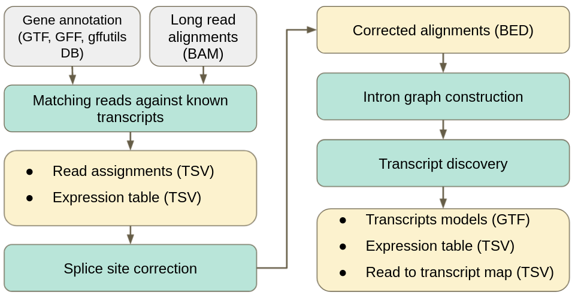

[](https://anaconda.org/bioconda/isoquant)
[](https://www.python.org/downloads/)
[](https://www.gnu.org/licenses/old-licenses/gpl-2.0)
[](https://github.com/ablab/IsoQuant/releases/)
[](https://github.com/ablab/IsoQuant/releases)


# IsoQuant 3.0 manual

1. [About IsoQuant](#sec1) </br>
1.1. [Supported data types](#sec1.1)</br>
1.2. [Supported reference data](#sec1.2)</br>
2. [Installation](#sec2)</br>
2.1. [Installing from conda](#sec2.1)</br>
2.2. [Manual installation and requirements](#sec2.2)</br>
2.3. [Verifying your installation](#sec2.3)</br>
3. [Running IsoQuant](#sec3)</br>
3.1. [IsoQuant input](#sec3.1)</br>
3.2. [Command line options](#sec3.2)</br>
3.3. [IsoQuant output](#sec3.3)</br>
4. [Citation](#sec4)</br>
5. [Feedback and bug reports](#sec5)</br>

**Quick start:**  

*   IsoQuant can be downloaded from [https://github.com/ablab/IsoQuant](https://github.com/ablab/IsoQuant) or installed via conda:

        conda create -c conda-forge -c bioconda -n isoquant python=3 isoquant

*   If installing manually, you will need Python3 (3.7 or higher), [gffutils](https://pythonhosted.org/gffutils/installation.html), [pysam](https://pysam.readthedocs.io/en/latest/index.html), [pybedtools](https://daler.github.io/pybedtools/), [biopython](https://biopython.org/) and some other common Python libraries to be installed. See `requirements.txt` for details. You will also need to have [minimap2](https://github.com/lh3/minimap2) and [samtools](http://www.htslib.org/download/) to be in your `$PATH` variable.
  
*   To run IsoQuant on raw FASTQ/FASTA files use the following command

        isoquant.py --reference /PATH/TO/reference_genome.fasta 
        --genedb /PATH/TO/gene_annotation.gtf 
        --fastq /PATH/TO/sample1.fastq.gz /PATH/TO/sample2.fastq.gz 
        --data_type (assembly|pacbio_ccs|nanopore) -o OUTPUT_FOLDER


* To run IsoQuant on aligned reads (make sure your BAM is sorted and indexed) use the following command:

        isoquant.py --reference /PATH/TO/reference_genome.fasta  
        --genedb /PATH/TO/gene_annotation.gtf 
        --bam /PATH/TO/sample1.sorted.bam /PATH/TO/sample2.sorted.bam 
        --data_type (assembly|pacbio_ccs|nanopore) -o OUTPUT_FOLDER

* If using official annotations containing `gene` and `transcript` features use `--complete_genedb` to save time.

* Using reference annotation is optional since version 3.0, you may preform de novo transcript discovery without providing `--genedb` option':

        isoquant.py --reference /PATH/TO/reference_genome.fasta 
        --fastq /PATH/TO/sample1.fastq.gz /PATH/TO/sample2.fastq.gz 
        --data_type (assembly|pacbio_ccs|nanopore) -o OUTPUT_FOLDER

<a name="sec1"></a>
# About IsoQuant

IsoQuant is a tool for the genome-based analysis of long RNA reads, such as PacBio or 
Oxford Nanopores. IsoQuant allows to reconstruct and quantify transcript models with 
high precision and decent recall. If the reference annotation is given, IsoQuant also 
assigns reads to the annotated isoforms based on their intron and exon structure. 
IsoQuant further performs annotated gene, isoform, exon and intron quantification. 
If reads are grouped (e.g. according to cell type), counts are reported according to the provided grouping. 


IsoQuant version 3.0.3 was released under GPLv2 on October 17th, 2022 and can be downloaded from [https://github.com/ablab/IsoQuant](https://github.com/ablab/IsoQuant).

#### IsoQuant pipeline
 

<a name="sec1.1"></a>
## Supported data types

IsoQuant support all kinds of long RNA data:
* PacBio CCS 
* ONT dRNA / ONT cDNA
* Assembled / corrected transcript sequences

Reads must be provided in FASTQ or FASTA format (can be gzipped). If you have already aligned your reads to the reference genome, simply provide sorted and indexed BAM files.

<a name="sec1.2"></a>
## Supported reference data

Reference genome should be provided in multi-FASTA format (can be gzipped). 
Reference genome is mandatory even when BAM files are provided.

Reference gene annotation is not mandatory, but may increase precision and recall.
It can be provided in GFF/GTF format (can be gzipped). 
In this case it will be converted to [gffutils](https://pythonhosted.org/gffutils/installation.html) database. Information on converted databases will be stored in your `~/.config/IsoQuant/db_config.json` to increase speed of future runs. You can also provide gffutils database manually. Make sure that chromosome/scaffold names are identical in FASTA file and gene annotation.

Pre-constructed aligner index can also be provided to increase mapping time.

<a name="sec2"></a>
# Installation
IsoQuant requires a 64-bit Linux system or Mac OS and Python (3.7 and higher) to be pre-installed on it. 
You will also need 
* [gffutils](https://pythonhosted.org/gffutils/installation.html) 
* [pysam](https://pysam.readthedocs.io/en/latest/index.html) 
* [biopython](https://biopython.org/)
* [pybedtools](https://daler.github.io/pybedtools/)
* [pandas](https://pandas.pydata.org/)
* [numpy](https://numpy.org/)
* [minimap2](https://github.com/lh3/minimap2) 
* [samtools](http://www.htslib.org/download/) 
* [STAR](https://github.com/alexdobin/STAR) (optional)

<a name="sec2.1"></a>
## Installing from conda
Isoquant can be installed with conda:
```bash
conda install -c bioconda isoquant
```

If this command does not work, it means that bioconda is not updated yet. Try installing via:
```bash
conda create -n isoquant python=3.7
conda activate isoquant
conda install -c bioconda -c conda-forge -c isoquant isoquant
```

<a name="sec2.2"></a>
## Manual installation and requirements
To obtain IsoQuant you can download repository and install requirements.  
Clone IsoQuant repository and switch to latest release:
```bash
git clone https://github.com/ablab/IsoQuant.git
cd IsoQuant
git checkout latest
```
Install requirements:
```bash
pip install -r requirements.txt
```

You also need [samtools](http://www.htslib.org/download/) and [minimap2](https://github.com/lh3/minimap2) to be in the `$PATH` variable.
  
<a name="sec2.3"></a>
## Verifying your installation 
To verify IsoQuant installation type
```bash
isoquant.py --test
```
to run on toy dataset.  
If the installation is successful, you will find the following information at the end of the log:
```bash
=== IsoQuant pipeline finished === 
=== TEST PASSED CORRECTLY ===
```

<a name="sec3"></a>
# Running IsoQuant
<a name="sec3.1"></a>
## IsoQuant input
To run IsoQuant, you should provide:
* reads in FASTA/FASTQ (can be gzipped) or sorted and indexed BAM;
* reference sequence in FASTA format (can be gzipped).

Optionally, you may provide a reference gene annotation in gffutils database or GTF/GFF format (can be gzipped);


By default, each file with reads is treated as a separate sample. 
To group multiple files into a single sample, provide a text files with paths to your FASTQ/FASTA/BAM files. 
Provide each file in a separate line, leave blank lines between samples.
See more in [examples](#examples).

<a name="sec3.2"></a>
## IsoQuant command line options


### Basic options
`--output` (or `-o`) 
    Output folder, will be created automatically.

Note: if your output folder is located on a shared disk, use `--genedb_output` for storing
reference annotation database.

`--help` (or `-h`) 
    Prints help message.

`--full_help` 
    Prints all available options (including hidden ones).

`--test` 
    Runs IsoQuant on the toy data set.   


### Input options
`--data_type` or `-d`
    Type of data to process, supported values are:  `pacbio_ccs` (same `pacbio` as), `nanopore` (same as `ont`) 
and  `assembly` (same as `transcripts`). This option affects the algorithm parameters.

`--reference` or `-r`
    Reference genome in FASTA format (can be gzipped), required even when BAM files are provided.

`--index`
    Reference genome index for the specified aligner (`minimap2` by default), 
can be provided only when raw reads are used as an input (constructed automatically if not set).

`--genedb` or `-g`
    Gene database in gffutils database format or GTF/GFF format (can be gzipped). 
If you use official gene annotations we recommend to set `--complete_genedb` option.

`--complete_genedb`
    Set this flag if gene annotation contains transcript and gene meta-features. 
Use this flag when providing official annotations, e.g. GENCODE. 
This option will set `disable_infer_transcripts` and `disable_infer_genes` gffutils options, 
which dramatically speeds up gene database conversion (see more [here](https://pythonhosted.org/gffutils/autodocs/gffutils.create_db.html?highlight=disable_infer_transcripts)).

#### Using mapped reads as input:
To provide aligned reads use one of the following options:

`--bam`
    Sorted and indexed BAM file(s); each file will be treated as a separate sample.

`--bam_list` 
    Text file with list of BAM files, one file per line, leave empty line between samples. 
You may also give an alias for each file specifying it after a colon (e.g. `/PATH/TO/file.bam:replicate1`).
Use this option to obtain per-replicate expression table (see `--read_group` option). 

#### Using raw read as an input:  
To provide read sequences use one of the following options:

`--fastq` 
    Input FASTQ/FASTA file(s), can be gzipped; each file will be treated as a separate sample.
  
`--fastq_list` 
    Text file with list of FASTQ/FASTA files (can be gzipped), one file per line, leave empty line between samples.
You may also give an alias for each file specifying it after a colon (e.g. `/PATH/TO/file.fastq:replicate1`).
Use this option to obtain per-replicate expression table (see `--read_group` option). 

#### Other input options:
`--stranded`
    Reads strandness type, supported values are: `forward`, `reverse`, `none`.

`--fl_data`
    Input sequences represent full-length transcripts; both ends of the sequence are considered to be reliable.

`--labels` or `-l`
    Sets space-separated sample names. Make sure that the number of labels is equal to the number of samples. 
Input file names are used as labels if not set.

`--read_group`
 Sets a way to group feature counts (e.g. by cell type or replicate). Available options are:
 * `file_name`: groups reads by their original file names (or file name aliases) within a sample. 
This option makes sense when a sample contains multiple files (see `--bam_list` and `--fastq_list` options to learn more).
This option is designed for obtaining expression tables with a separate column for each file (replicate).
 * `tag`: groups reads by BAM file read tag: set `tag:TAG`, where `TAG` is the desired tag name (e.g. `tag:RG` with use `RG` values as groups);
 * `read_id`: groups reads by read name suffix: set `read_id:DELIM` where `DELIM` is the symbol/string by which the read id will be split (e.g. if `DELIM` is `_`, for read `m54158_180727_042959_59310706_ccs_NEU` the group will set as `NEU`);
 * `file`: uses additional file with group information for every read: `file:FILE:READ_COL:GROUP_COL:DELIM`, where `FILE` is the file name, `READ_COL` is column with read ids (0 if not set), `GROUP_COL` is column with group ids (1 if not set), `DELIM` is separator symbol (tab if not set). File can be gzipped.
  

### Output options

`--sqanti_output`
    Produce SQANTI-like TSV output (requires more time).

`--check_canonical`
    Report whether read or constructed transcript model contains non-canonical splice junction (requires more time).

`--count_exons`
    Perform exon and intron counting in addition to gene and transcript counting.


### Pipeline options

`--resume`
    Resume a previously unfinished run. Output folder with previous run must be specified.
    Allowed options are `--threads`, `--low_memory` and `--debug`, other options cannot be changed.
    IsoQuant will run from the beginning if the output folder does not contain the previous run.

`--force`
    force to overwrite the folder with previous run.

`--threads` or `-t`
    Number of threads to use, 16 by default. 

`--clean_start`
    Do not use previously generated gene database, genome indices or BAM files, run pipeline from the very beginning (will take more time).

`--no_model_construction`
    Do not report transcript models, run read assignment and quantification of reference features only. 

`--run_aligner_only` 
    Align reads to the reference without running IsoQuant itself.


### Algorithm parameters

#### Qunatification

`--transcript_quantification` Transcript quantification strategy, should be one of:

* `unique_only` - only reads that are uniquely assigned and consistent with a transcript are used for quantification (default);
* `with_ambiguous` - ambiguously assigned reads are split between transcripts with equal weights (e.g. 1/2 when a read is assigned to 2 transcripts simultaneously);
* `with_inconsistent` - uniquely assigned reads with non-intronic inconsistencies (i.e. alternative poly-A site, TSS etc) are also included;
* `all` - all of above.
                       
`--gene_quantification` Gene quantification strategy, should be one of:

* `unique_only` -  only reads that are uniquely assigned to a gene and consistent with any of gene's isoforms are used for quantification;
* `with_ambiguous` - ambiguously assigned reads are split between genes with equal weights (e.g. 1/2 when a read is assigned to 2 genes simultaneously);
* `with_inconsistent` - only reads that are uniquely assigned to a gene but not necessary consistent with gene's isoforms (default); 
* `all` - all of above.


#### Read to isoform matching:

`--matching_strategy` A preset of parameters for read-to-isoform matching algorithm, should be one of:

* `exact` - delta = 0, all minor errors are treated as inconsistencies;  
* `precise` - delta = 4, only minor alignment errors are allowed, default for PacBio data;  
* `default` - delta = 6, alignment errors typical for Nanopore reads are allowed, short novel introns are treated as deletions;   
* `loose` - delta = 12, even more serious inconsistencies are ignored, ambiguity is resolved based on nucleotide similarity.

Matching strategy is chosen automatically based on specified data type. 
However, the parameters will be overridden if the matching strategy is set manually.

#### Read alignment correction:

`--splice_correction_strategy` A preset of parameters for read alignment correction algorithms, should be one of: 

* `none` - no correction is applied;  
* `default_pacbio` - optimal settings for PacBio CCS reads;
* `default_ont` - optimal settings for ONT reads;
* `conservative_ont` - conservative settings for ONT reads, only incorrect splice junction and skipped exons are fixed;
* `assembly` - optimal settings for a transcriptome assembly;    
* `all` - correct all discovered minor inconsistencies, may result in overcorrection.

This option is chosen automatically based on specified data type, but will be overridden if set manually.

#### Transcript model construction:
`--model_construction_strategy` A preset of parameters for transcript model construction algorithm, should be one of

* `reliable` - only the most abundant and reliable transcripts are reported, precise, but not sensitive;  
* `default_pacbio` - optimal settings for PacBio CCS reads;
* `sensitive_pacbio` - sensitive settings for PacBio CCS reads, more transcripts are reported possibly at a cost of precision;
* `fl_pacbio` - optimal settings for full-length PacBio CCS reads, will be used if `--data_type pacbio_ccs` and `--fl_data` options are set; 
* `default_ont` - optimal settings for ONT reads;
* `sensitive_ont` - sensitive settings for ONT reads, more transcripts are reported possibly at a cost of precision;
* `assembly` - optimal settings for a transcriptome assembly: input sequences are considered to be reliable and each transcript to be represented only once, so abundance is not considered;    
* `all` - reports almost all novel transcripts, loses precision in favor to recall.

This option is chosen automatically based on specified data type, but will be overridden if set manually.


### Hidden options
Options below are shown only with `--full_help` option. 
We recommend to not modify these options unless you are clearly aware of their effect.
    
`--no_secondary`
    Ignore secondary alignments.

`--aligner`
    Force to use this alignment method, can be `starlong` or `minimap2`; `minimap2` is currently used as default. Make sure the specified aligner is in the `$PATH` variable.

`--no_junc_bed`
    Do not use annotation for read mapping.

`--junc_bed_file`
    Annotation in BED12 format produced by `paftools.js gff2bed` (can be found in `minimap2`), will be created automatically if not given.

`--delta` 
    Delta for inexact splice junction comparison, chosen automatically based on data type.

`--genedb_output`
    If your output folder is located on a shared storage (e.g. NFS share), use this option to set another path 
    for storing the annotation database, because SQLite database cannot be created on a shared disks. 
    The folder will be created automatically.


### Examples
<a name="examples"></a>

* Mapped PacBio CCS reads in BAM format; pre-converted gene annotation:

```bash
isoquant.py -d pacbio_ccs --bam mapped_reads.bam \
 --genedb annotation.db --output output_dir 
```

* Nanopore dRNA stranded reads; official annotation in GTF format, used sample label instead of file name:
```bash
isoquant.py -d nanopore --stranded forward --fastq ONT.raw.fastq.gz \
 --reference reference.fasta --genedb annotation.gtf --complete_genedb \ 
 --output output_dir --labels My_ONT
```

* Nanopore cDNA reads; no reference annotation:
```bash
isoquant.py -d nanopore --fastq ONT.cDNA.raw.fastq.gz \
 --reference reference.fasta --output output_dir --labels My_ONT_cDNA
```

* PacBio FL reads; custom annotation in GTF format, which contains only exon features:
```bash
isoquant.py -d pacbio_ccs --fl_data --fastq CCS.fastq \
 --reference reference.fasta --genedb genes.gtf --output output_dir 
```

* ONT cDNA reads; 2 samples with 3 replicates (biological or technical); official annotation in GTF format:
```bash
isoquant.py -d nanopore --fastq_list list.txt  \
 --read_group file_name -l SAMPLE1 SAMPLE2   \
 --complete_genedb --genedb genes.gtf \
 --reference reference.fasta --output output_dir 
```

list.txt file :
```
/PATH/TO/SAMPLE1/file1.fastq:S1_REPLICATE1
/PATH/TO/SAMPLE1/file2.fastq:S1_REPLICATE2
/PATH/TO/SAMPLE1/file3.fastq:S1_REPLICATE3

/PATH/TO/SAMPLE2/file1.fastq:S2_REPLICATE1
/PATH/TO/SAMPLE2/file2.fastq:S2_REPLICATE2
/PATH/TO/SAMPLE2/file3.fastq:S2_REPLICATE3

```
Note, that file aliases given after a colon will be used in expression table header. 

* ONT cDNA reads; 2 samples with 2 replicates, each replicate has 2 files; official annotation in GTF format:
```bash
isoquant.py -d nanopore --fastq_list list.txt \
 --read_group file_name -l SAMPLE1 SAMPLE2 \
 --complete_genedb --genedb genes.gtf \
 --reference reference.fasta --output output_dir 
```

list.txt file :
```
/PATH/TO/SAMPLE1/r1_1.fastq:S1_REPLICATE1
/PATH/TO/SAMPLE1/r1_2.fastq:S1_REPLICATE1
/PATH/TO/SAMPLE1/r2_1.fastq:S1_REPLICATE2
/PATH/TO/SAMPLE1/r2_2.fastq:S1_REPLICATE2

/PATH/TO/SAMPLE2/r1_1.fastq:S2_REPLICATE1
/PATH/TO/SAMPLE2/r1_2.fastq:S2_REPLICATE1
/PATH/TO/SAMPLE2/r2_1.fastq:S2_REPLICATE2
/PATH/TO/SAMPLE2/r2_2.fastq:S2_REPLICATE2

```
Note, that file aliases given after a colon will be used in expression table header. 

<a name="sec3.3"></a>
## IsoQuant output

### Output files

IsoQuant output files will be stored in `<output_dir>`, which is set by the user. 
If the output directory was not specified the files are stored in `isoquant_output`.  
Output directory will contain one folder per sample with the following files:  

* `SAMPLE_ID.transcript_models.gtf` - GTF file with constructed transcript models (both known and novel transcripts);
* `SAMPLE_ID.transcript_model_reads.tsv` - TSV file indicating which reads contributed to transcript models;
* `SAMPLE_ID.transcript_model_tpm.tsv` - expression of constructed transcript models in TPM;
* `SAMPLE_ID.transcript_model_counts.tsv` - raw counts for constructed transcript models;
* `SAMPLE_ID.extended_annotation.gtf` - GTF file with the entire reference annotation plus all discovered novel transcripts;

* `SAMPLE_ID.read_assignments.tsv` - TSV file with each read to isoform assignments;
* `SAMPLE_ID.corrected_reads.bed` - BED file with corrected read alignments;
* `SAMPLE_ID.transcript_tpm.tsv` - TSV file with isoform expression in TPM;
* `SAMPLE_ID.transcript_counts.tsv` - TSV file with raw isoform counts;
* `SAMPLE_ID.gene_tpm.tsv` - TSV file with gene expression in TPM;
* `SAMPLE_ID.gene_counts.tsv` - TSV file with raw gene counts;

If `--sqanti_output` is set, IsoQuant will save read assignments in [SQANTI](https://github.com/ConesaLab/SQANTI3)-like format:
* `SAMPLE_ID.SQANTI-like.tsv`

If `--count_exons` is set, exon and intron counts will be produced:
* `SAMPLE_ID.exon_counts.tsv`
* `SAMPLE_ID.intron_counts.tsv`

If `--read_group` is set, the per-group counts will be also computed:
* `SAMPLE_ID.gene_grouped_tpm.tsv`
* `SAMPLE_ID.transcript_grouped_tpm.tsv`
* `SAMPLE_ID.gene_grouped_counts.tsv`
* `SAMPLE_ID.transcript_grouped_counts.tsv`
* `SAMPLE_ID.exon_grouped_counts.tsv`
* `SAMPLE_ID.intron_grouped_counts.tsv`

If multiple samples are provided, aggregated expression matrices will be placed in `<output_dir>`:
* `combined_gene_counts.tsv`
* `combined_gene_tpm.tsv`
* `combined_transcript_counts.tsv`
* `combined_transcript_tpm.tsv`

Additionally, a log file will be saved to the directory.  
* <output_dir>/isoquant.log   

If raw reads were provided, BAM file(s) will be stored in `<output_dir>/<SAMPLE_ID>/aux/`.  
In case `--keep_tmp` option was specified this directory will also contain temporary files.

### Output file formats

Although most output files include headers that describe the data, a brief explanation of the output files is provided below.

#### Read to isoform assignment

Tab-separated values, the columns are:

* `read_id` - read id;
* `chr` - chromosome id;
* `strand` - strand of the assigned isoform (not to be confused with read mapping strand);
* `isoform_id` - isoform id to which the read was assigned;
* `gene_id` - gene id to which the read was assigned; 
* `assignment_type` - assignment type, can be:
    - `unique` - reads was unambiguously assigned to a single known isoform;
    - `unique_minor_difference` - read was assigned uniquely but has alignment artifacts;
    - `inconsistent` - read was matched with inconsistencies, closest match(es) are reported;
    - `ambiguous` - read was assigned to multiple isoforms equally well;
    - `noninfomative` - reads is intronic/intergenic.
* `assignment_events` - list of detected inconsistencies; for each assigned isoform a list of detected inconsistencies relative to the respective isoform is stored; values in each list are separated by `+` symbol, lists are separated by comma, the number of lists equals to the number of assigned isoforms; possible events are (see graphical representation below):
    - consistent events:
        - `none` / `.` / `undefined` - no special event detected;
        - `mono_exon_match` mono-exonic read matched to mono-exonic transcript;
        - `fsm` - full splice match;
        - `ism_5/3` - incomplete splice match, truncated on 5'/3' side;
        - `ism_internal` - incomplete splice match, truncated on both sides;
        - `mono_exonic` - mono-exonic read matching spliced isoform;
    - alignment artifacts:
        - `intron_shift` - intron that seems to be shifted due to misalignment (typical for Nanopores);
        - `exon_misalignment` - short exon that seems to be missed due to misalignment  (typical for Nanopores);
        - `fake_terminal_exon_5/3` - short terminal exon at 5'/3' end that looks like an alignment artifact (typical for Nanopores);  
        - `terminal_exon_misalignment_5/3` - missed reference short terminal exon; 
        - `exon_elongation_5/3` - minor exon extension at 5'/3' end (not exceeding 30bp);
        - `fake_micro_intron_retention` - short annotated introns are often missed by the aligners and thus are not considered as intron retention;
    - intron retentions:
        - `intron_retention` - intron retention;
        - `unspliced_intron_retention`  - intron retention by mono-exonic read;
        - `incomplete_intron_retention_5/3` - terminal exon at 5'/3' end partially covers adjacent intron;
    - significant inconsistencies (each type end with `_known` if _all_ resulting read introns are annotated and `_novel` otherwise):
        - `major_exon_elongation_5/3` - significant exon extension at 5'/3' end (exceeding 30bp);
        - `extra_intron_5/3` - additional intron on the 5'/3' end of the isoform;
        - `extra_intron` - read contains additional intron in the middle of exon;
        - `alt_donor_site` - read contains alternative donor site;
        - `alt_acceptor_site` - read contains alternative annotated acceptor site;
        - `intron_migration` - read contains alternative annotated intron of approximately the same length as in the isoform;
        - `intron_alternation` - read contains alternative intron, which doesn't fall intro any of the categories above;
        - `mutually_exclusive_exons` - read contains different exon(s) of the same total length comparing to the isoform;
        - `exon_skipping` - read skips exon(s) comparing to the isoform;
        - `exon_merge` - read skips exon(s) comparing to the isoform, but a sequence of a similar length is attached to a neighboring exon;
        - `exon_gain` - read contains additional exon(s) comparing to the isoform;
        - `exon_detach` - read contains additional exon(s) comparing to the isoform, but a neighboring exon looses a sequnce of a similar length;
        - `terminal_exon_shift` - read has alternative terminal exon;   
        - `alternative_structure` - reads has different intron chain that does not fall into any of categories above;
    - alternative transcription start / end (reported when CAGE data / poly-A tails are present):
        - `alternative_polya_site` - read has alternative polyadenylation site;
        - `internal_polya_site` - poly-A tail detected but seems to be originated from A-rich intronic region;
        - `correct_polya_site` - poly-A site matches reference transcript end;
        - `aligned_polya_tail` - poly-A tail aligns to the reference;  
        - `alternative_tss` - alternative transcription start site.
* `exons` - list of coordinates for normalized read exons (1-based, indels and polyA exons are excluded);
* `additional` - field for supplementary information, which may include:
    - `PolyA` - True if poly-A tail is detected;
    - `CAGE` - True if CAGE peak is found;
    - `Canonical` - True if all read introns are canonical, Unspliced is used for mono-exon reads; (use `--check_canonical`) 

Note, that a single read may occur more than once if assigned ambiguously.

#### Expression table format

Tab-separated values, the columns are:

* `feature_id` - genomic feature ID;
* `TPM` or `count` - expression value (float).

For grouped counts, each column contains expression values of a respective group.
In the number of groups exceeds 10, file will contain 3 columns: 

* `feature_id` - genomic feature ID;
* `group_id` - name of the assigned group;
* `TPM` or `count` - expression value (float).

#### Exon and intron count format

Tab-separated values, the columns are:

* `chr` - chromosome ID;
* `start` - feature leftmost 1-based positions;
* `end` - feature rightmost 1-based positions;
* `strand` - feature strand;
* `flags` - symbolic feature flags, can contain the following characters:
    - `X` - terminal feature;
    - `I` - internal feature;
    - `T` - feature appears as both terminal and internal in different isoforms;
    - `S` - feature has similar positions to some other feature;
    - `C` - feature is contained in another feature;
    - `U` - unique feature, appears only in a single known isoform;
    - `M` - feature appears in multiple different genes.
* `gene_ids` - list if gene ids feature belong to;
* `group_id` - read group if provided (NA by default);
* `include_counts` - number of reads that include this feature;
* `exclude_counts` - number of reads that span, but do not include this feature; 

#### Transcript models format

Constructed transcript models are stored in usual [GTF format](https://www.ensembl.org/info/website/upload/gff.html).
Contains `exon`, `transcript` and `gene` features. 
Transcript ids have the following format: `transcript_###.TYPE`, 
where `###` is the unique number (not necessarily consecutive) and TYPE can be one of the following:
* known - previously annotated transcripts;
* nic - novel in catalog, new transcript that contains only annotated introns;
* nnic - novel not in catalog, new transcript that contains unannotated introns.

The `attribute` field also contains `gene_id` (either matches reference gene id or can be `novel_gene_###`), `reference_gene_id` (same value) and `reference_transcript_id` (either original isoform id or `novel`).
In addition, it contains `canonical` property if `--check_canonical` is set. 

### Event classification figures
#### Consistent match classifications
 <br><br>

#### Misalignment classifications
 <br><br>

#### Inconsistency classifications
 <br><br>

#### PolyA classifications
 

<a name="sec4"></a>
## Citation
The preprint is available at [https://www.researchsquare.com/article/rs-1571850/v1](https://www.researchsquare.com/article/rs-1571850/v1)

<a name="sec5"></a>
## Feedback and bug reports
Your comments, bug reports, and suggestions are very welcome. They will help us to further improve IsoQuant. If you have any troubles running IsoQuant, please send us `isoquant.log` from the `<output_dir>` directory. 

You can leave your comments and bug reports at our [GitHub repository tracker](https://github.com/ablab/IsoQuant/issues) or send them via email: isoquant.rna@gmail.com.

