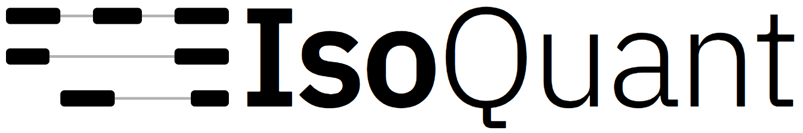
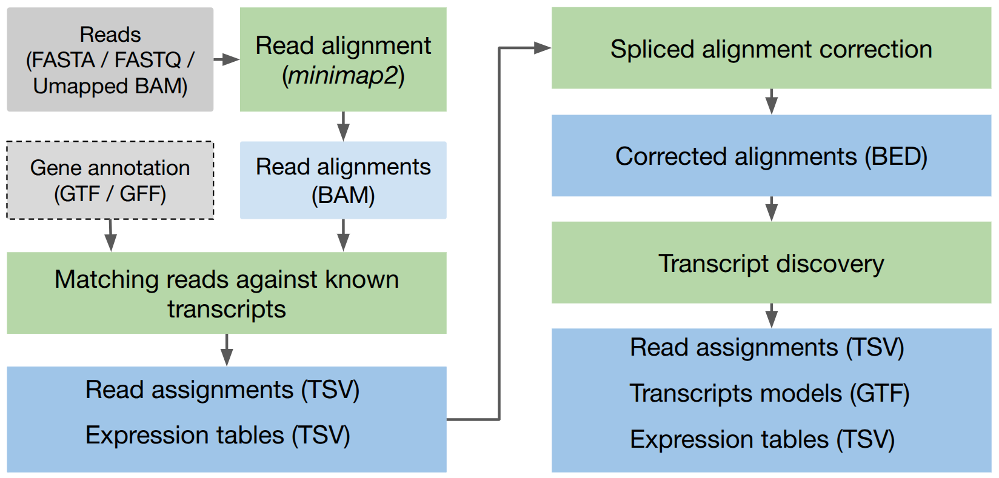
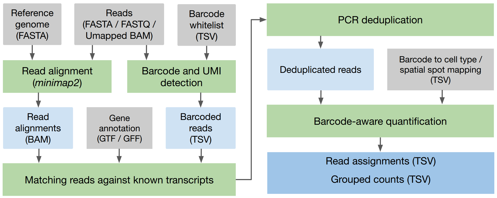

IsoQuant is a tool for the genome-based analysis of long RNA reads, such as PacBio or
Oxford Nanopores. IsoQuant can perform the following analysis:

- **Quantification**:
  - Gene and transcript quantification;
  - Exon, splice junction, and intron retention quantification;
  - Detecting PolyA site and TSS;
  - Per-condition quantification (counts grouping);

- **Isoform and gene discovery**:
  - Annotation-based isoform discovery;
  - _De novo_ transcript and gene discovery;
  - Fusion gene discovery;

- **Single-cell and spatial transcriptomic analysis**:
  - Barcode calling for 10x single-cell, 10x Visisum and Visium HD, Curio, Stereo-seq;
  - Universal barcode calling for user-specified protocols;
  - PCR deduplication;
  - Per-barcode and per-cell-type quantification;

The latest IsoQuant version can be downloaded from [https://github.com/ablab/IsoQuant/releases/latest](https://github.com/ablab/IsoQuant/releases/latest).

### IsoQuant pipeline

### IsoQuant pipeline for single-cell and spatial transcriptomic data

